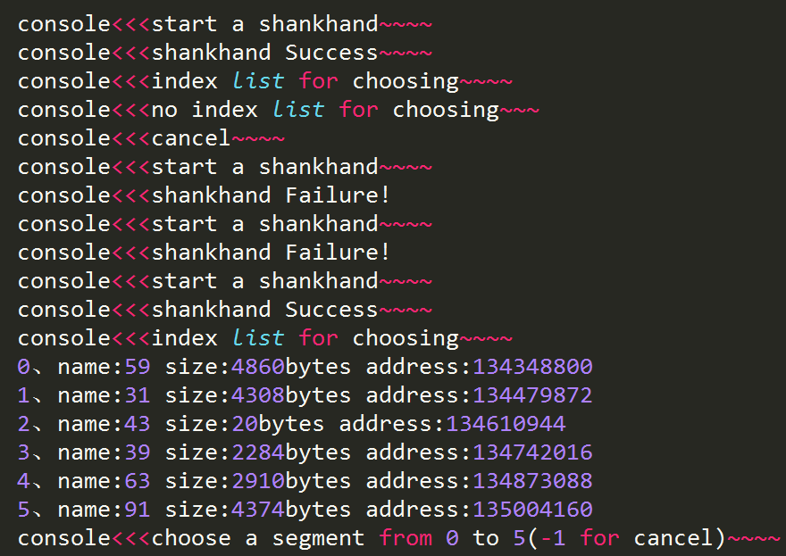
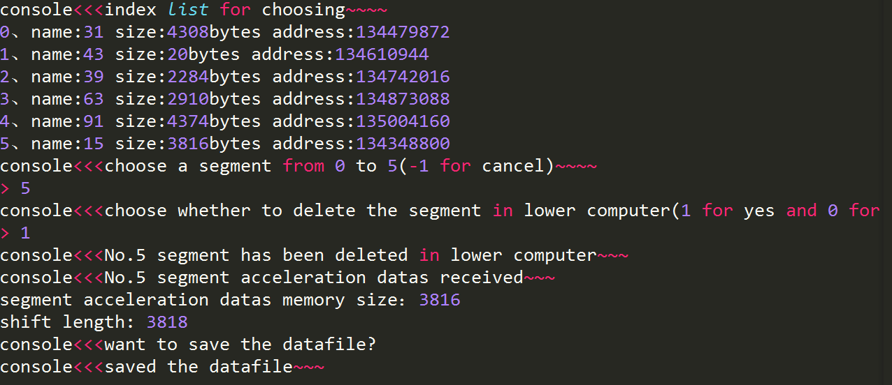
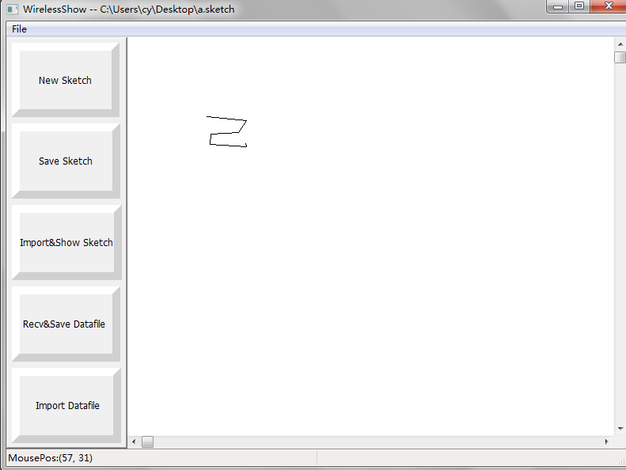
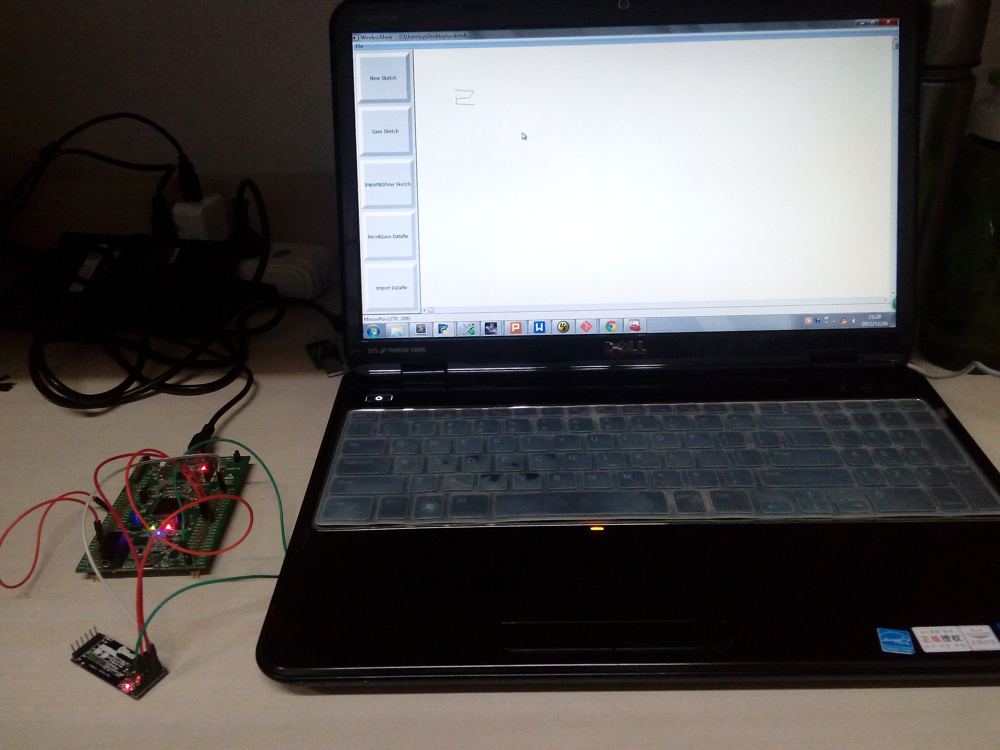

<!DOCTYPE html>
<html class="   ">
  <head>
  </head>

  <body class="logged_in  env-production windows vis-public page-blob">
 
<h1>

wirelessShow
</h1>

一个用python实现的<strong>图形绘制软件</strong>，可接收串口传递的加速度数据并通过计算绘制出图形<strong>轨迹</strong>……

<h2>
<a name="upper-computer-part" class="anchor" href="#upper-computer-part"></a>一、上位机部分(upper computer part)</h2>

<h3>
<a name="general-description" class="anchor" href="#general-description"></a>1、总体说明(general description)</h3>

<ul class="task-list">
<li>（1）上位机软件采用python 2.7开发，操作平台为windows；</li>
<li>（2）上位机软件中，有两类重要文件：*.df和*.sketch。其中，*.df文件保存位移数据（为便于在gui中显示做了适当平移），*.sketch文件保存图形数据。上位机软件的全部操作都围绕这两类文件展开；</li>
<li>（3）上位机系统有gui和console两套环境，两套环境需配合使用。</li>
</ul>

<h3>
<a name="how-to-use" class="anchor" href="#how-to-use"></a>2、使用说明(how to use)</h3>
<ul class="task-list">
<li>（1）gui环境下的使用：关于这两类数据的生成与使用如下：
     <ul class="task-list">
        <li>a、用户可通过Recv&Save Datafile按钮接收下位机数据并保存为*.df文件；</li>
				<li>b、用户可通过Import Datafile按钮导入*.df文件并在gui环境下生成轨迹图形，并可通过Save Sketch按钮将当前正显示的轨迹图形保存为*.sketch文件；</li>
				<li>c、用户可通过Import&Show Sketch按钮直接导入*.sketch文件查看轨迹图形；</li>
				<li>d、用户可通过New Sketch按钮可新建一个空白显示页，但会失去未保存为*.sketch的轨迹图形。</li>
     </ul>
</li>

<li>（2）console环境下的使用
     <ul class="task-list">
     	<li>a、上位机软件gui环境下由用户按下Recv&Save Datafile按钮后，进入串口数据接收状态；</li>
			<li>b、串口数据接收状态下，上位机自动打开串口等待接收下位机数据（超时等待10s），握手成功后才能在console（控制台）环境下进行交互通信，否	则此次通信结束；</li>
			<li>c、握手成功后，上位机自动在console环境下打印下位机存储的segment(记录段)的index（索引）；</li>
			<li>d、用户可通过console选择所需segment的index，并选择是否删除此segment的下位机版本（即是否回收下位机中对应存储空间）；</li>
			<li>e、完成选择后，上位机自动接收下位机后续发送过来的相应segment数据（加速度传感器采样值（二维）），在做数据处理计算出位移后，将位移数据保存为*.df文件供gui环境下使用。</li>
     </ul>
</li>
</ul>

<h2>
<a name="lower-computer-part" class="anchor" href="#lower-computer-part"></a>二、下位机部分(lower computer part)</h2>
refer to <a href="https://github.com/hugochan/wirelessShow_lowerComputer">hugochan/wirelessShow_lowerComputer.</a>

<h2>
<a name="presentation" class="anchor" href="#presentation"></a>三、图片展示(presentation)</h2>
<h3>
	
上位机控制台
</h3>
&nbsp;&nbsp;&nbsp;&nbsp;</img>
    

<h3>
	
上位机控制台2
</h3>
&nbsp;&nbsp;&nbsp;&nbsp;</img>
    

<h3>
	
上位机GUI
</h3>
&nbsp;&nbsp;&nbsp;&nbsp;</img>
    

<h3>
	
系统效果图
</h3>
&nbsp;&nbsp;&nbsp;&nbsp;</img>

</body>
</html>

